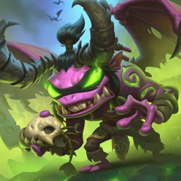

<p align="center">
  
  <h1 align="center">鱼利丹（Yulidan）</h1>
  <p align="center"><em>“The Fel, the Deceiver… 现在是你的本地 AI Agent。”</em></p>
  <p align="center">
    
    
    
    
    
    
  </p>
</p>

> 鱼利丹——取魔兽世界伊利丹（Illidan）谐音梗，一个 Swift 6 原生（SwiftUI + AppKit）的本地 AI Agent 应用。
> 无 WebView / Electron / JS，全部本地代码，macOS 26（Tahoe）基线（`Package.swift .macOS(.v26)` +
> deployment target 26.0，彻底不兼容旧系统），Apple Silicon 优先。
>
> 工程代号 **Harness**：目录名 / 模块名 / bundle id / 数据路径沿用该代号（身份锚与依赖图约束）；用户可见品牌统一为鱼利丹（`AppBrand` 单点管理）。
> 预构建版：[Releases](https://github.com/opsbsligm/yulidan/releases) 下载 DMG，拖入应用程序即可（ad-hoc 签名，首次右键→打开）。
>
> **现状与权威信息源**：MVP 已交付（tag `mvp-0.1.0`），打磨迭代中。贡献前请先读 [CONTRIBUTING.md](CONTRIBUTING.md)；安全边界见 [SECURITY.md](SECURITY.md)。四门禁台账见 `QUALITY_REPORT.md` 头部主表；
> 阶段史与核销链见 `P1_STAGE_REPORT.md`；待拍板事项见 `docs/DECISION_INDEX.md`；
> 社区插件兼容矩阵见 `docs/DSH_COMMUNITY_PLUGIN_CENSUS.md`；性能护栏见 `docs/PERFORMANCE.md`。

## 🏗️ 架构

```
swift-harness/
├── Package.swift                 # SPM 根清单（所有模块 + 可执行 target）
├── project.yml                   # xcodegen 配置（生成 swift-harness.xcodeproj）
├── Packages/                     # 业务模块（各含 Sources/ + Tests/）
│   ├── ServiceContainer/         # 插件框架：PluginManager / EventBus / 熔断器
│   ├── Session/                  # 会话模型 + GRDB 持久化（SessionDB）
│   ├── LLM/                      # LLM 适配层：OpenAI 兼容 / DeepSeek / Anthropic / 本地
│   ├── Tools/                    # 工具系统：ToolRegistry + 内置真实工具
│   ├── Agent/                    # Agent 核心：Loop / Inbox / Turn
│   ├── Workspace/ Goal/ Plan/ Skill/
│   ├── MCP/ Subagent/ Sandbox/ Terminal/
├── Apps/
│   ├── HarnessApp/               # macOS SwiftUI 应用（全中文界面）
│   ├── HarnessCore/              # App 与包之间的组装层
│   ├── DSHCLI/                   # 命令行工具（ArgumentParser，入口 dsh）
│   └── MemProbe/                 # 内存/性能探针（配合 leaks 使用）
├── Support/CSQLite/              # GRDB CSQLite modulemap 副本（Xcode 构建用，见下文）
└── docs/                         # 设计文档
```

依赖关系：`ServiceContainer ← (Session/LLM/Tools/Agent) ← HarnessCore ← HarnessApp / DSHCLI`

## ✅ 已实现的真实能力

| 能力 | 实现 |
|------|------|
| 真实 LLM API | `LLM` 包内置 OpenAI 兼容客户端（非流式 + SSE 流式 + 连接检测），OpenAI / DeepSeek / Anthropic / 本地（Ollama 兼容，默认 `http://localhost:11434/v1`）；中文错误分类提示（401/402/403/404/429/5xx） |
| 真实插件 | App 启动时把 `BuiltInFilesystemPlugin` / `BuiltInTerminalPlugin` 注册进 `PluginManager`，侧栏插件开关真实 install/uninstall |
| 真实工具 | `read_file` / `write_file` / `list_files` / `exec_command`（zsh，带超时与管道防死锁）/ `web_fetch`（网页抓取，协议白名单 + 大小上限），从 `ToolRegistry` 读取并由 LLM 工具调用真实执行 |
| 会话持久化 | GRDB 6.29.3，数据库位于 `~/Library/Application Support/Harness/sessions.sqlite`，支持多会话/排序/事件重写 |
| 主题 | 深色 / 浅色 / 跟随系统（**默认跟随系统**，设置页可切换，真实应用 `NSApp.appearance`） |
| 会话操作 | 附件（文本 ≤200KB）、复制、导出 Markdown、重命名、删除 |

## 🚀 构建与运行（SPM 方式，推荐日常开发）

```bash
swift build              # 构建全部 target
swift test               # 829 个 Swift Testing 测试 / 181 suites（2026-09-10 门禁实测）
swift run dsh            # 运行 CLI
swift run HarnessApp     # 运行 macOS App
```

### 内存/性能验证（Instruments/leaks）

```bash
swift run MemProbe 500                       # 循环 500 次核心路径（存读删+工具+插件）
leaks --atExit -- .build/debug/MemProbe 500  # 期望输出 0 leaks
```

> GUI 进程直接跑 `leaks --atExit` 拿不到报告，MemProbe 就是为此设计的无界面探针。

## 🛠️ Xcode 调试

### 方式一：打开 .xcodeproj（xcodegen 生成，含全部 scheme）

```bash
open swift-harness.xcodeproj
# scheme：HarnessApp（App+测试）/ All（App+CLI+MemProbe）/ 各模块
```

命令行等价命令：

```bash
xcodegen generate   # 修改 project.yml 或增删源文件后必须重新生成
xcodebuild -project swift-harness.xcodeproj -scheme HarnessApp -configuration Debug build
xcodebuild -project swift-harness.xcodeproj -scheme HarnessApp -configuration Debug test
```

### 方式二：直接用 Xcode 打开 SPM 包（Xcode 16+）

```bash
open Package.swift
```

同样能获得所有 scheme 并调试 `HarnessApp` 可执行 target，不依赖 xcodegen。

### ⚠️ 两个已知 Xcode 构建坑（已在 project.yml 中修复，勿随意回退）

1. **GRDB 的 `CSQLite` 是 SPM `systemLibrary` target**。Xcode 26 的 explicit module build
   不会把它的 modulemap 传播给无链接阶段的静态库 target，导致
   `unable to resolve module dependency: 'CSQLite'`；而直接声明 GRDB 产品的 target 会拿到
   checkout 的 modulemap，再叠加副本会报 `redefinition of module 'CSQLite'`。
   解法：`Support/CSQLite/` 存放 GRDB v6.29.3 的 modulemap+shim.h **字节级一致副本**，
   仅注入给 10 个静态库 target（project.yml 各 target 的 `OTHER_SWIFT_FLAGS`）；
   可链接 target（App/CLI/测试 bundle）则直接声明 GRDB 产品依赖（同时解决 GRDB.o 不链接的问题）。
   **升级 GRDB 大版本时必须同步检查并更新该副本**（`Support/CSQLite/README.txt`）。
2. **可执行入口文件不能叫 `main.swift`**：Xcode 中名为 main.swift 的文件与 `@main` 冲突。
   本项目入口文件为 `Apps/DSHCLI/Sources/DSHMain.swift`、`Apps/MemProbe/Sources/MemProbeMain.swift`。

## ⚙️ 模型配置（App 设置页）

- 提供商：OpenAI / DeepSeek / Anthropic / 本地（Ollama 兼容），切换后模型列表联动
- **API Key 存入 macOS 钥匙串**（Keychain，不写 UserDefaults/代码）
- 本地服务可改地址（默认 `http://localhost:11434/v1`）、max tokens、系统提示词
- 「测试连接」按钮发起真实 `/models`（或探测请求）校验
- 未配置 Key 时：对话页顶部橙色提示，发送会给出明确中文错误（不会崩溃）

## 📊 测试与覆盖率

- SPM：`swift test` — 829 tests / 181 suites 全过（2026-09-10 门禁实测；含 LLM HTTP mock、内置工具、GRDB 持久化）
- Xcode：`xcodebuild test` — 5 个测试 bundle（XCTest）全过
- 覆盖率（coverage-report.txt，2026-08-14 基线）：ServiceContainer 91% / Session 96% / Agent 98% / Tools 94%

## ⚠️ 风险提示

- `exec_command` 工具会以当前用户身份执行 `/bin/zsh -c`，**具备真实系统操作能力**（有超时保护）。
  接入生产/共享环境前建议：增加高危命令确认、限制工作目录、或走 `Sandbox` 包做沙箱化。
- 工具读写文件目前不做路径白名单，建议按部署场景在 App 层补充约束。
- GitHub 私有库：https://github.com/opsbsligm/yulidan （main 分支；Release 提供 macOS DMG）

## 📄 License

MIT
